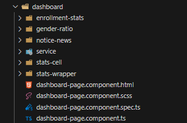
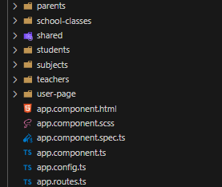
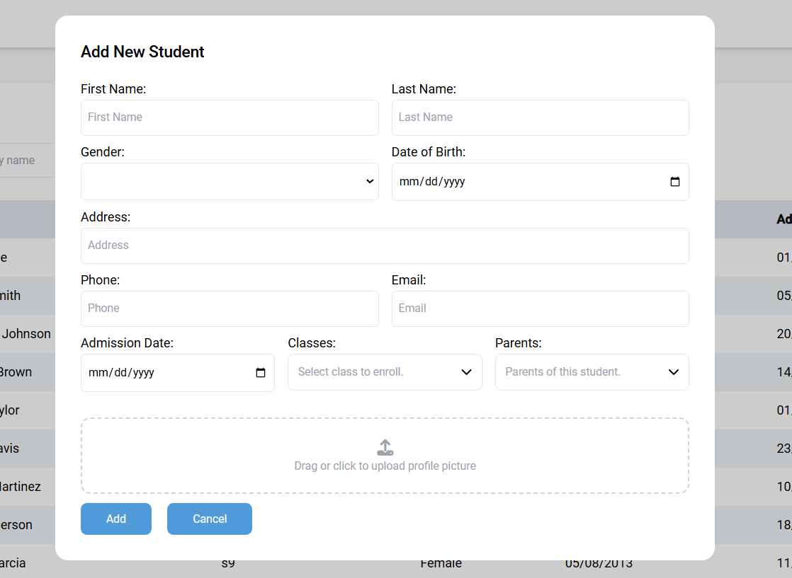
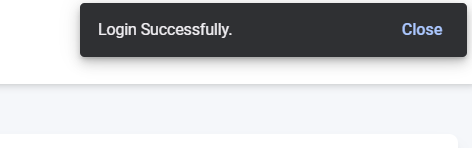

# School Management Dashboard

This project is a comprehensive School Management Dashboard built with Angular. It provides an intuitive interface for managing various aspects of a school, including students, teachers, parents, classes, and more. The dashboard includes various charts and statistics to help visualize data effectively.

## Table of Contents

- [Features](#features)
- [Installation](#installation)
- [Usage](#usage)
- [Project Structure](#project-structure)
- [Components](#components)
- [Services](#services)
- [Routes](#routes)
- [Contributions](#contributions)
- [License](#license)

## Features

- Token-based authentication.
- Admin Dashboard with various statistics.
- Charts for visualizing data.
- Navigation between different sections (students, teachers, parents, classes, etc.)
- CRUD operations on entities.
- Notice board for announcements.

## Installation

1. Clone the repository:
   ```sh
   git clone https://github.com/taynguyen3110/school-management.git
2. Navigate to the project directory:
    ```sh
    cd school-management-dashboard
3. Install the dependencies:
    ```sh
    npm install

## Usage

Start the development server:
    ```sh
    ng serve -o

## Project Structure

.angular/
.cache/
.editorconfig
.gitignore
.vscode/
[extensions.json](http://_vscodecontentref_/0)
launch.json
[tasks.json](http://_vscodecontentref_/1)
[angular.json](http://_vscodecontentref_/2)
[package.json](http://_vscodecontentref_/3)
public/
assets/
images/
[test.js](http://_vscodecontentref_/4)
[README.md](http://_vscodecontentref_/5)
src/
app/
[app.component.html](http://_vscodecontentref_/6)
app.component.scss
app.component.spec.ts
[app.component.ts](http://_vscodecontentref_/7)
app.config.ts
app.routes.ts
auth/
dashboard/
parents/
school-classes/
shared/
students/
...
[index.html](http://_vscodecontentref_/8)
main.ts
mock/
...
[styles.scss](http://_vscodecontentref_/9)
[tailwind.config.js](http://_vscodecontentref_/10)
[tsconfig.app.json](http://_vscodecontentref_/11)
[tsconfig.json](http://_vscodecontentref_/12)
[tsconfig.spec.json](http://_vscodecontentref_/13)

## Components


Dashboard Components
    DashboardComponent: Main component for the dashboard overview.
    GenderRatioComponent: Displays the gender ratio chart.
    EnrollmentStatsComponent: Displays enrollment statistics.
    StatsWrapperComponent: Container for multiple statistics components.
    StatsCellComponent: Individual statistic display component.
    NoticeNewsComponent: Shows announcements and news updates.


Other Components
    StudentsComponent: Manages student-related data and actions.
    TeachersComponent: Manages teacher-related data and actions.
    ParentsComponent: Manages parent-related data and actions.
    ClassesComponent: Manages class-related data and actions.
    

Services
    NavigationService: Handles navigation between different routes.
    DashboardService: Fetches statistical data for the dashboard.
    AuthService: Manages authentication and user sessions.
    NotificationService: Handles user notifications and alerts.

## Routes

All routes for the application are defined in src/app/app.routes.ts. Below are some of the main routes:

    / - Dashboard

    /students - Students

    /students/:id - Student Profile

    /teachers - Teachers

    /teachers/:id - Teacher Profile

    /parents - Parents

    /parents/:id - Parent Profile

    /subjects - Subjects

    /subjects/:id - Subject Detail

    /classes - Classes

    /classes/:id - Class Detail

    /user - User Profile

## Contributions

Key Contributions


**Dashboard Development**

    Implemented the main dashboard layout and components, including DashboardComponent, StatsWrapperComponent, and StatsCellComponent.
    Created dynamic charts for the gender ratio and enrollment statistics using GenderRatioComponent and EnrollmentStatsComponent.



**Form Handling**

    Built reusable form components like InputComponent and AddNewFormLayoutComponent.
    Added form validation and submission logic in components such as AddStudentComponent and AddTeacherComponent.

**Profile Management**

    Developed profile components for students, teachers, and parents, including StudentProfileComponent, TeacherProfileComponent, and ParentProfileComponent.
    Enabled profile photo and info display with ProfilePhotoComponent and ProfileInfoComponent.


**Authentication**

    Implemented authentication using AuthService and AuthApiService.
    Created a secure login page with validation and error handling.



**Notification**

**Technical Skills Demonstrated**

    Angular: Built a complex Angular application with reusable components, services, and modules.
    TypeScript: Used TypeScript for type safety and maintainability.
    Reactive Forms: Implemented reactive forms with dynamic controls and validation.
    State Management: Utilized Angular services and RxJS for efficient state management.
    API Integration: Integrated RESTful APIs for data operations and updates.

## License

This project is licensed under the MIT License. See the LICENSE file for more details.